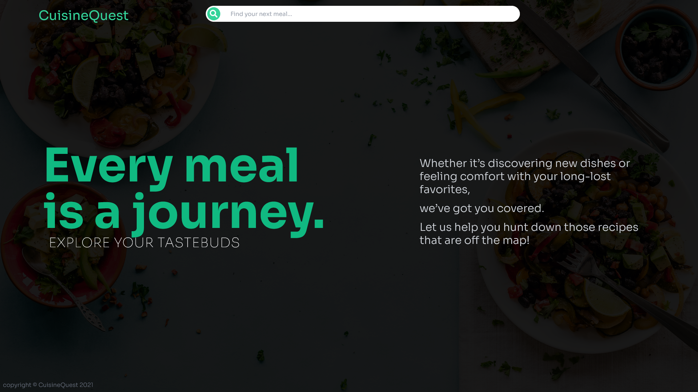
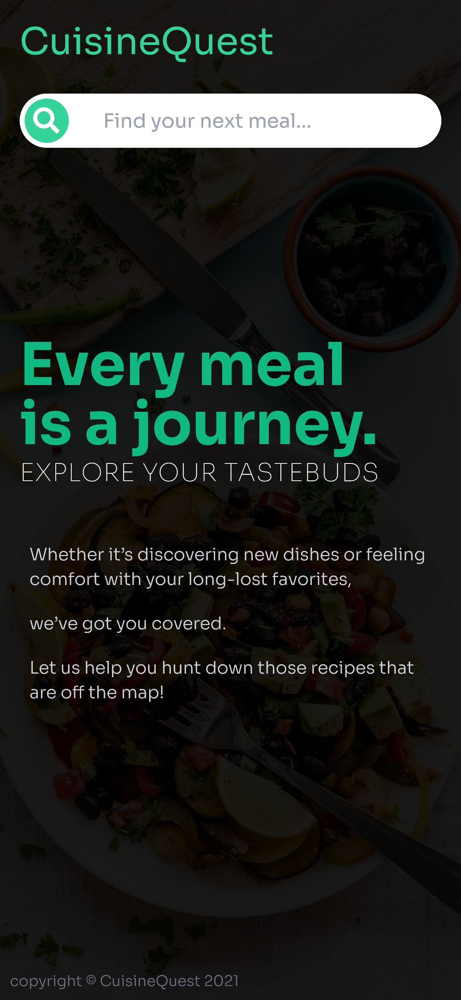

# CuisineQuest V2 (NextJS and Firebase)
View the [Figma](https://www.figma.com/file/3XKkJLAIlIsSjV0vpkz266/CuisineQuestV2?node-id=0%3A1) Prototype.

## Previous Version info

The first version was a simple app that only allowed the user to perform a simple search. In V2, I will be porting the project from Vanilla React to NextJS and adding login support through Firebase google Oauth.

Screenshots of V1:

  
  

View [V1's github](https://github.com/SilasCundiff/cuisinequest)

